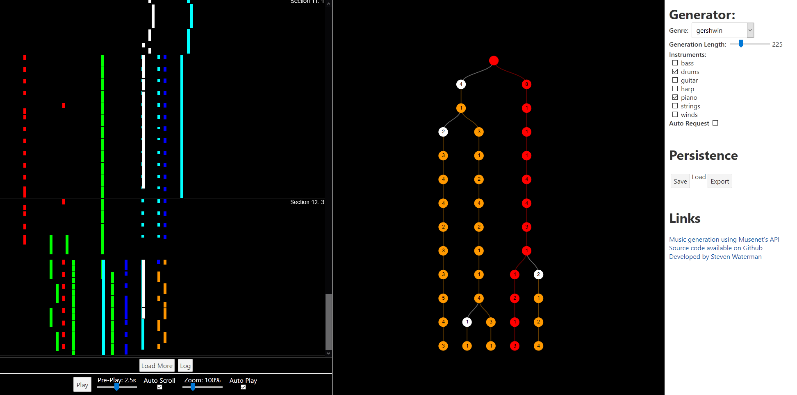

# MuseTree

MuseTree is a custom front-end for [MuseNet](https://openai.com/blog/musenet/).
It is designed for real music production, and aims to fix the problems with the official app.

A live version is [hosted online](http://musetree.stevenwaterman.uk)

## Features

* Full tree support - you don't have to pick one of four options and be stuck with it
* All 57 MuseNet genres supported
* Wider range of generation options
* Save/Load encoding
* Export Audio

## Developer instructions

MuseTree uses the [svelte](https://svelte.dev/) web framework.

Quick Start:

* `git clone`
* `npm i`
* `npm run dev`
